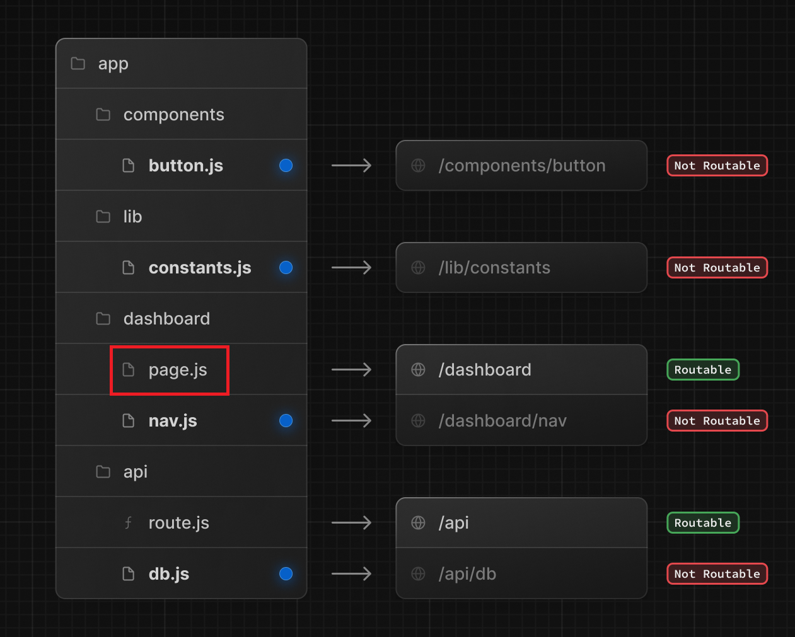
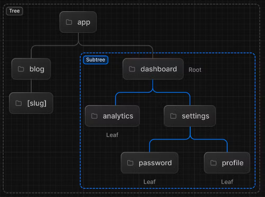

# Créer des routes

### 💡 Comment créer des routes avec Next

## 📝 Tes notes

Détaille ce que tu as appris sur une page [Notion](https://go.mikecodeur.com/course-notes-template)

## Comprendre

Avec `React` nous devons utiliser une librairie externe comme `React-Router` et ensuite gérer la configuration des routes et des composants associés à ces routes.

Avec Next la création d’une route se fait simplement par ajout d’un répertoire dans `app` et d’un fichier nommé `page.jsx` ou `page.tsx` en `TypeScript` :

```tsx
export default function Page() {
  return <h1>Hello, Cela est ma première route</h1>
}
```

- En terme de structure cela ressemble à :



[http://localhost:3000/courses-assets/1-project-organization-colocation.png](http://localhost:3000/courses-assets/1-project-organization-colocation.png)

📑 Le lien vers la doc : [https://nextjs.org/docs/app/building-your-application/routing/defining-routes](https://nextjs.org/docs/app/building-your-application/routing/defining-routes)

## Exercice

Nous allons créer une première route `/exercise/about`  qui affiche `“Je suis un développeur FullStack Next”`

<aside>
💡 Comme les exercices se font dans le dossier `exercise` et la solution dans le dossier `final` nous allons garder cette structure.

</aside>

Créer donc un dossier `about` dans le répertoire `exercise` avec un fichier `page.tsx`

Fichiers

- `exercise/about/page`

## Bonus

### 1. 🚀 Générer un sous-arbre

La hiérarchie complète des routes est appelée `Arbre` (`Tree`). Cet arbre est composé de sous-arbres (`subtrees`) qui contiennent des `racines` et des `feuilles` (dernier élément) 



[http://localhost:3000/courses-assets/1-route-tree.png](http://localhost:3000/courses-assets/1-route-tree.png)

Dans cet exercice tu vas devoir créer 

- un sous arbre `account` (dans `exercise`)
    - une feuille `details`
    - ET un sous arbre `profile`
        - avec 2 feuilles `password` et `reset`

<aside>
💡 Constate que la route : [/final/account/profile](http://localhost:3000/final/account/profile) n’existe pas

</aside>

Fichiers

- `exercise/account/page`
- `exercise/account/details/page`
- `exercise/account/profile/page`
- `exercise/account/profile/password/page`
- `exercise/account/profile/reset/page`

### 2. 🚀 Rendre la route profile accessible

Ajoute un composant pour rendre la route accessible 

Fichiers

- `exercise/account/profile`

## Aller plus loin

📑 Le lien vers la doc [https://nextjs.org/docs/app/building-your-application/routing/defining-routes](https://nextjs.org/docs/app/building-your-application/routing/defining-routes)

## Ils vont t’aider

- **🐶  Mowgli le Chien** : *Mowgli te guidera dans chaque exercice.*
- **🤖  Ash le Robot** : *Ash le Robot te donnera du code utile.*
- **🚀 Julia La roquette** : *Julia te donnera des défis supplémentaires.*
- **⛏️ Hulk le Marteau** : *Quand du code à supprimer est présent*
- **👨‍✈️ Hugo le chef de projet** : *Va t'aider sur les spécifications du projet*

## 🐜 Feedback

Remplir le formulaire le [formulaire de FeedBack](https://go.mikecodeur.com/cours-next-avis?entry.1912869708=Next%20PRO&entry.1430994900=01.Les%20Fondamentaux&entry.533578441=02%20Les%20routes).